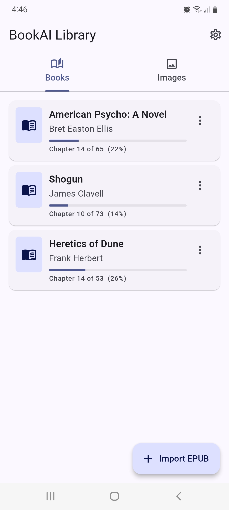
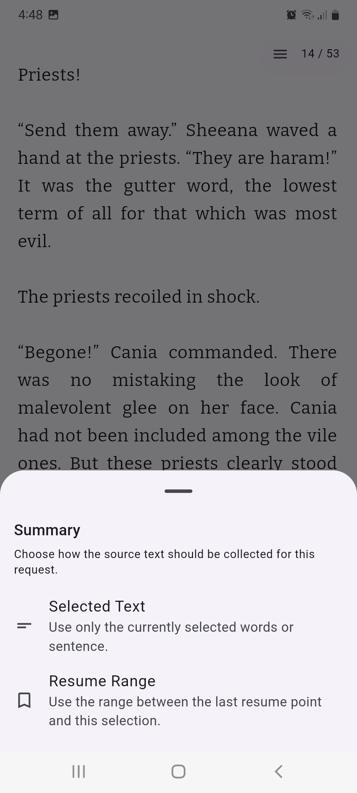
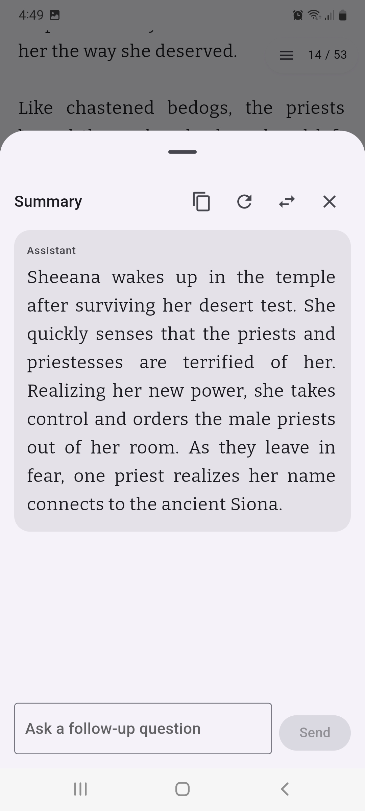
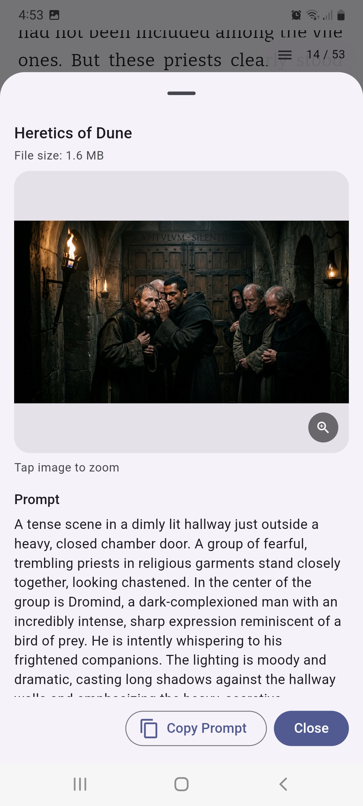

# BookAI

BookAI is an EPUB reader built with Flutter. It can explain difficult words, translate text, answer questions about a passage, give a short recap, make difficult text easier to understand, and generate images from scenes in the book. To use these features, you need an OpenRouter or Gemini API key. Both offer free usage with limits.

## What BookAI Does

- Import EPUB files into an on-device library
- Read chapter by chapter with saved progress
- Highlight passages and save a manual "resume here" point
- Keep generated images in a separate library tab
- Let you choose your own AI provider and models instead of relying on a BookAI backend

## AI Features

- **Resume Here and Catch Me Up**: Creates a short catch-up from selected text or from the range between your last resume point and the current selection.
- **Simplify Text**: Rewrites a passage in clearer, simpler language without intentionally turning it into a summary.
- **Ask AI**: Answers questions about a selected passage and supports follow-up chat.
- **Define & Translate**: Explains a selected word, phrase, or character name in context and translates it. The default prompt translates into Russian.
- **Generate Image**: Turns a passage into an image prompt, lets you refine that prompt, then sends it to an image-capable model and saves the returned image locally.

Advanced configuration is built in:

- Choose a default text model
- Set a fallback text model
- Choose a separate image model
- Override the prompt template and text model for each AI feature

## OpenRouter and Gemini Keys

BookAI does not ship with shared API keys, and it does not ask users to set environment variables. End users add keys directly inside the app:

1. Open **Settings**.
2. Paste an **OpenRouter API Key** (`sk-or-v1-...`) and/or a **Gemini API Key** (`AIza...`).
3. Pick a **Default Model** for text features.
4. Optionally pick a **Fallback Model** for retries.
5. Pick an **Image Model** if you want to use **Generate Image**.
6. Optionally customize prompt templates or per-feature model overrides.

Notes:

- You only need a provider key if you want AI features.
- You can use either provider for text features.
- You can mix providers, for example one provider for text and another for image generation.

## What Stays Local

BookAI is local-first by default.

Stored locally on the device:

- Imported EPUB files copied into app-local storage
- Library metadata and parsed chapters in the local database
- Reading progress
- Highlights
- Resume markers
- Generated image files and their saved prompt metadata
- API keys
- Selected models
- Theme, font, and AI feature settings

What leaves the device when you use AI:

- The selected text or resume range you chose
- Context sentence, book title, author, and chapter title when the feature prompt uses them
- Your Ask AI question and follow-up messages
- The final image prompt sent to the chosen image model
- Model list requests when you browse available models in Settings

BookAI currently has:

- No BookAI account system
- No BookAI cloud sync
- No BookAI-hosted AI proxy between the app and OpenRouter/Gemini

If you use AI, your requests go directly to the selected provider, and that provider's own retention and privacy policies apply.

## Supported Platforms

Current app targets:

- Android
- iOS
- macOS
- Windows
- Linux

Not currently supported:

- Web

The repository includes a `web/` directory because this is a Flutter project, but the current app still depends on native local storage/database behavior and `dart:io`, so the web build is not ready yet.

## Screenshots

<p align="center">
  
  
  
</p>

<p align="center">
  
  
  
</p>

<p align="center">
  
</p>


## Getting Started

### Prerequisites

- [Flutter SDK](https://docs.flutter.dev/get-started/install) `>=3.4.4`
- Platform toolchain for your target OS
- Your own OpenRouter and/or Gemini key if you want AI features

### Run

```bash
flutter pub get
flutter run
```

### Checks

```bash
flutter analyze
flutter test
```

Use standard Flutter build commands for your target platform, for example:

```bash
flutter build apk --release
```

## Roadmap

Planned directions for the project:

- Richer EPUB rendering with covers, inline images, and better formatting support
- Full-text search inside books
- Better export and sharing for highlights and generated images
- Sync and backup across devices
- More language presets and reading-assistance workflows
- Better multi-image generation and image management
- Web support

## Known Limitations

- EPUB chapters are currently rendered as plain text, so rich HTML/CSS formatting and inline media are not preserved in the reader.
- Cover extraction is not implemented yet.
- There is no full-text search.
- There is no built-in sync or backup.
- Highlights and resume markers cannot be exported yet.
- The image workflow currently saves a single returned image into the local library flow.
- The default Define & Translate setup is tuned for English explanation plus Russian translation.
- Web is not supported yet.
